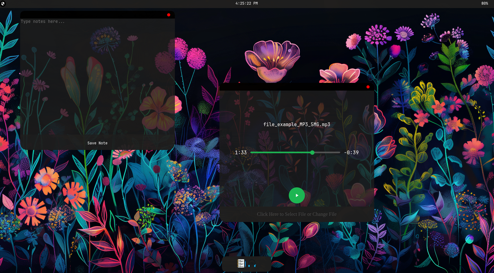

PrivateOS
An OS designed to run local files!

In order to test it out use the [Github Pages](https://suvrathkesaraju-lgtm.github.io/PrivateOS/) Deployement

- Features a full desktop with a appdock and a top bar
- top bar features a time widget and features a battery widget(MUST USE CHROMIUM BASED BROWSER ex: chrome, edge. Does not work on Firefox or Brave)
- Features a notes app where you can write down notes and save it to a local txt file
- features an  audio player that lets you select a local audio file and play it!

It works by using divs to create windows which have a defined structure in css and each app has its own backend in script.js. For example the notes app converts the written text in the text area into a .txt file then creates a temporary url for the txt file and after the user downloads the file that temporary download URL is deleted.

Made for Stardance by HackClub

About ME:
I am a 15 year old who aspires to be a computer engineer. My name is Suvrath Kesaraju and I am currently a sopHmore at Robbinsville High School class of 2029!. My current short term goal is to get  into a good university by the time i graduate and i like coding to build up my portofolio.

Credits:
Mr.Mads on Magnific for the icons for the app from his free downloads (https://www.magnific.com/author/mrmads).
Thomas from HackClub for the basic guide from the provided missions (https://github.com/SerenityUX).